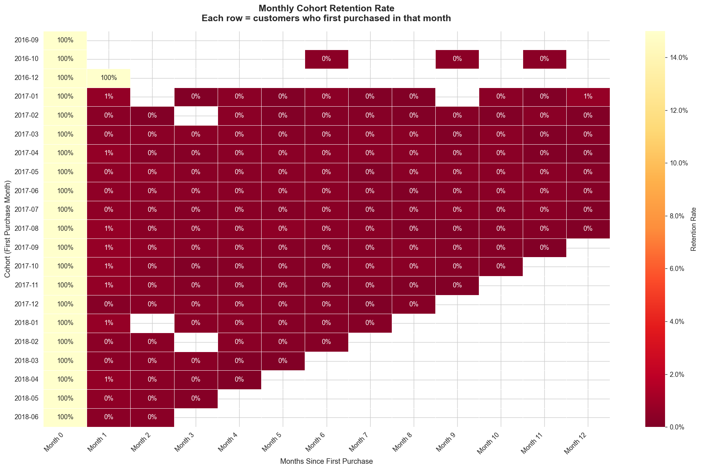
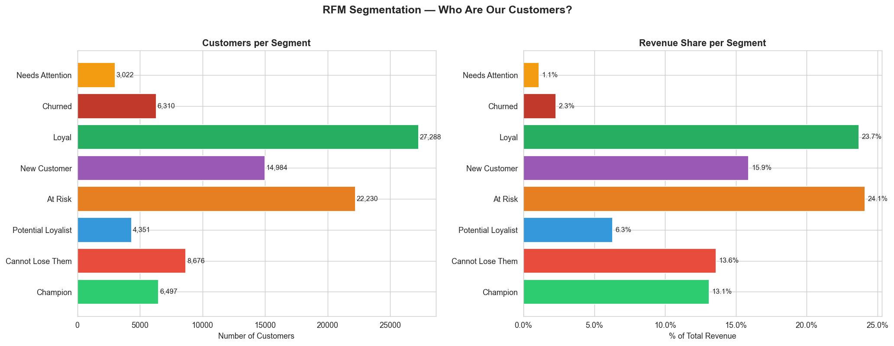
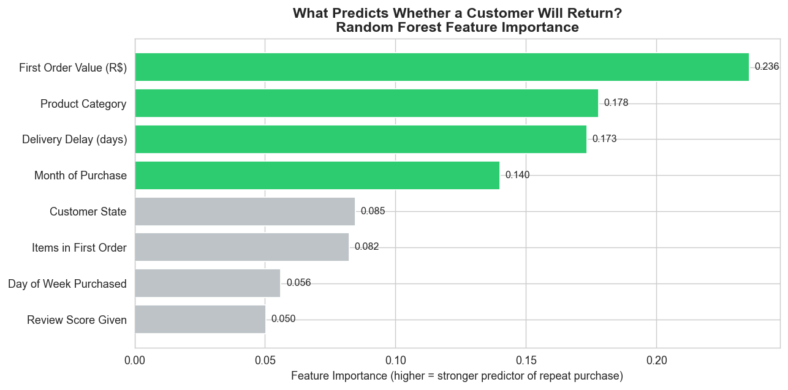

# Customer Behaviour & Retention Analysis
### E-Commerce Data Analytics Portfolio Project

**Tools:** Python · pandas · scikit-learn · SQL · Power BI  
**Dataset:** [Olist Brazilian E-Commerce](https://www.kaggle.com/datasets/olistbr/brazilian-ecommerce) (100k orders, 2016–2018)

---

## Business Problem

An e-commerce platform is growing in transaction volume but suspects a large share of customers never return after their first purchase. This project investigates *who* churns, *when*, and *what* factors predict repeat purchase behaviour, so marketing and product teams can prioritise retention over acquisition.

---

## Key Findings

| Finding | Business Implication |
|---------|----------------------|
| **97% of customers never returned** after their first order | Retention is a more urgent lever than acquisition |
| Month-1 retention averages **5.8%**, dropping to **0.3%** by Month 3 | The first 30 days are the only meaningful retention window |
| **Champions (7% of customers) drive 13.1% of revenue** | This segment must be protected and rewarded |
| **At Risk segment holds 24.1% of revenue**, avg last seen 394 days ago | Win-back campaigns here have the highest ROI |
| **First order value** is the strongest predictor of return | High-basket first orders signal long-term customer value |
| Late deliveries directly correlate with 1-star reviews | Fulfilment quality is a retention driver, not just a logistics metric |

---

## Project Structure

```
├── notebooks/
│   ├── 01_data_cleaning.ipynb        # Data loading, quality checks, feature engineering
│   └── 02_cohort_rfm_churn.ipynb     # Cohort analysis, RFM segmentation, churn model
├── sql/
│   ├── monthly_revenue.sql
│   ├── cohort_retention.sql
│   ├── repeat_purchase_rate.sql
│   └── category_satisfaction.sql
├── dashboard/
│   ├── customer_retention.pbix       # Power BI dashboard (4 pages)
│   └── screenshots/
├── data/
│   └── README.md                     # Dataset source and setup instructions
└── insights/
    └── executive_summary.md
```

---

## Analysis Walkthrough

### 1. Data Cleaning (`01_data_cleaning.ipynb`)
- Loaded 6 relational tables: customers, orders, order items, payments, reviews, products
- Parsed timestamps, filtered to 96,478 delivered orders
- Resolved the `customer_unique_id` duplication issue (3.1% of customers had multiple IDs)
- Built order-level revenue, flagged outliers above the 99th percentile (R$1,063)
- Exported `master_orders.csv` and `customer_summary.csv` to `data/processed/`

### 2. Cohort Retention Analysis (`02_cohort_rfm_churn.ipynb`)
Customers grouped by first purchase month. Retention tracked across 12 subsequent months.



### 3. RFM Segmentation
Every customer scored 1–5 on Recency, Frequency, and Monetary value and assigned to one of 8 business segments.



### 4. Churn Prediction Model
**Algorithm:** Random Forest Classifier  
**Target:** Will a customer make a second purchase?  
**Features:** First order value, product category, review score, delivery delay, geography, seasonality  
**ROC-AUC: 0.746** | Accuracy: 68%



**Top predictors of repeat purchase:**
1. First order value (higher spend → more likely to return)
2. Product category purchased
3. Review score given after first order

---

## SQL Queries

Core business questions answered in plain SQL (compatible with PostgreSQL / DuckDB / SQLite):

- `monthly_revenue.sql`: Revenue trend with MoM growth
- `cohort_retention.sql`: Retention matrix by first purchase cohort
- `repeat_purchase_rate.sql`: Platform-wide repeat rate
- `category_satisfaction.sql`: Revenue vs review score by product category

---

## Dashboard (Power BI)

Four-page dashboard built for a marketing/product stakeholder audience:

| Page | Focus |
|------|-------|
| Executive Summary | Revenue KPIs, order trends, new vs repeat customers |
| Cohort Retention | Retention heatmap, period-by-period drop-off |
| Customer Segments | RFM distribution, CLV by segment |
| Product & Experience | Category performance, delivery delay vs satisfaction |

---

## Recommendations

1. **Launch a Day-7 and Day-30 re-engagement email sequence** for all new customers, the data shows this is the only window where a second purchase is plausible
2. **Build a Champions loyalty tier**, 7% of customers generating 13% of revenue deserve differentiated treatment
3. **Use churn probability scores** to prioritise win-back campaigns on the At Risk and Cannot Lose Them segments
4. **Fix fulfilment for high-revenue, low-satisfaction categories** before spending on paid acquisition in those verticals

---

## How to Run

```bash
# 1. Clone the repo
git clone https://github.com/YOUR_USERNAME/customer-retention-analysis

# 2. Create virtual environment
python3.11 -m venv .venv
.venv/Scripts/pip install -r requirements.txt

# 3. Download dataset from Kaggle into /Olist
# https://www.kaggle.com/datasets/olistbr/brazilian-ecommerce

# 4. Run notebooks in order
jupyter lab
```

---

*Prepared by Jasline Mwita*
